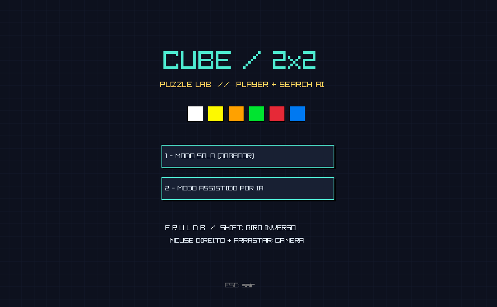
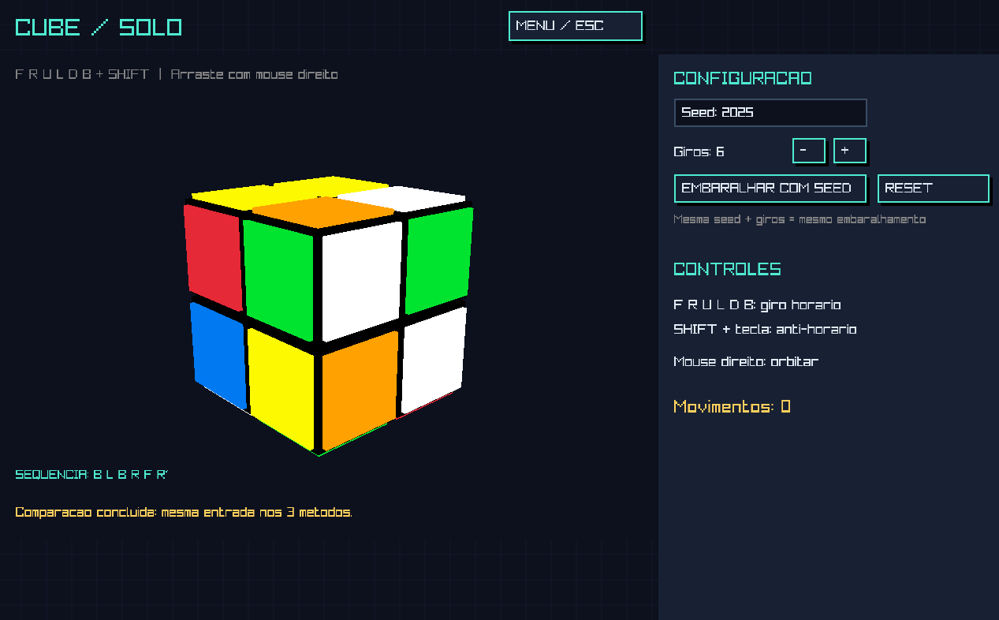
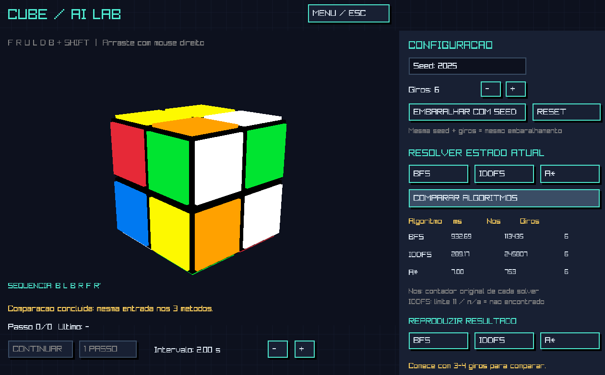
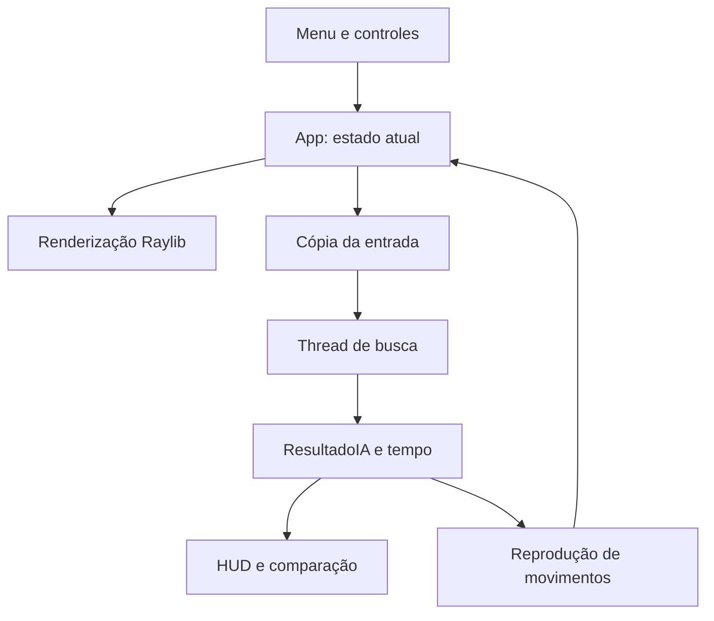

<div align="center">

# 🧩 Rubik's Cube 2x2 AI Solver
### 3D Interactive Suite & Search Algorithm Lab


**Resolva com as próprias mãos. Explore com Inteligência Artificial.**

Uma aplicação desktop em C++ que combina um cubo 2x2x2 interativo em 3D com três algoritmos clássicos de busca.
Embaralhe com seeds reproduzíveis, compare os métodos e acompanhe cada movimento da solução.

[Visão geral](#visao-geral) ·
[Demonstração](#demonstracao) ·
[Arquitetura](#arquitetura) ·
[Algoritmos](#algoritmos) ·
[Instalação](#instalacao)

</div>

---

> **Versão documentada:** branch `feat/raylib-gui`, commit `e844687`.
> A interface gráfica e os solvers estão nessa branch. Os comandos de instalação abaixo selecionam essa versão.

<a name="visao-geral"></a>

## ✨ Visão geral

O projeto transforma o cubo mágico 2x2x2 em um laboratório visual de busca em espaço de estados.

No **Modo Solo**, o jogador manipula o cubo por teclado, inspeciona suas faces com uma câmera orbital e recebe uma indicação visual quando resolve o desafio.

No **Modo IA**, o mesmo ambiente permite executar BFS, IDDFS ou A*, observar métricas e reproduzir as soluções passo a passo.

| Recurso | Implementação |
|---|---|
| Interface retro | Fundo quadriculado, paleta contrastante e botões com estilo pixel |
| Visualização 3D | Cubo renderizado com primitivas Raylib |
| Câmera orbital | Botão direito do mouse + arrastar |
| Manipulação manual | 12 movimentos: seis faces, nos dois sentidos |
| Embaralhamento reproduzível | `std::mt19937`, seed configurável e quantidade de giros |
| Busca sob demanda | BFS, IDDFS e A* |
| Interface responsiva | Busca executada em uma thread de trabalho |
| Reprodução da solução | Pausar, continuar, avançar um passo e ajustar intervalo |
| Solução textual | Sequência de movimentos exibida na janela e no terminal |
| Benchmark integrado | Três métodos executados sequencialmente sobre a mesma entrada |

A aplicação utiliza uma janela de **1280 × 800**, com alvo de **60 FPS**.

<a name="demonstracao"></a>

## 📸 Demonstração

<table>
  <tr>
    <td colspan="2" align="center">
      
      <br />
      <strong>01 — ENTER THE CUBE</strong>
      <br />
      <em>Menu retro e seleção de modo.</em>
    </td>
  </tr>
  <tr>
    <td width="50%" align="center">
      
      <br />
      <strong>02 — TAKE CONTROL</strong>
      <br />
      <em>Exploração 3D e resolução manual.</em>
    </td>
    <td width="50%" align="center">
      
      <br />
      <strong>03 — WATCH THE SEARCH</strong>
      <br />
      <em>Busca, métricas e reprodução de soluções.</em>
    </td>
  </tr>
</table>

<!-- Adicione as três capturas reais em docs/ com os nomes utilizados acima. -->

## 🚀 Primeiro experimento

1. Abra o **Modo Assistido por IA**.
2. Mantenha a seed `2026`.
3. Selecione **3 giros**.
4. Clique em **Embaralhar com Seed**.
5. Clique em **Comparar Algoritmos**.
6. Compare tempo, nós contabilizados e comprimento das soluções.
7. Escolha um algoritmo em **Reproduzir Resultado**.
8. Pause a reprodução e avance manualmente com **1 Passo**.

O benchmark preserva uma cópia do estado no momento da solicitação. Os três métodos recebem essa mesma configuração, mesmo que ela tenha sido construída manualmente.

> A quantidade de giros do embaralhamento não corresponde necessariamente à distância ótima até a solução.

<a name="arquitetura"></a>

## 🏗 Arquitetura

### Separação de responsabilidades

| Arquivo | Responsabilidade | Elementos principais |
|---|---|---|
| `cubo.hpp` | Modelo e operações sobre o estado | `cubo`, `faces`, giros, `verificador()`, `obter_chave()`, heurística |
| `solver.hpp` | Algoritmos de busca | `NoBusca`, `NoA`, `ResultadoIA`, BFS, IDDFS e A* |
| `render.hpp` | Representação gráfica do cubo | Conversão de cores e `desenharCubo3D()` |
| `main.cpp` | Aplicação e interação | Telas, entrada, câmera, benchmark, thread e reprodução |
| `include/` | Cabeçalhos gráficos incluídos no projeto | Raylib, Raymath e RLGL |

A lógica de busca não depende de chamadas gráficas. O renderizador recebe o estado do cubo, enquanto a aplicação coordena sua manipulação e apresentação.

### Fluxo de execução



### Modelo do cubo

O estado contém **24 adesivos**, representados por uma matriz:

```cpp
int faces[6][2][2];
```

| Índice | Face | Cor na configuração inicial |
|---:|---|---|
| 0 | `TOPO` | Branco |
| 1 | `BASE` | Amarelo |
| 2 | `ESQUERDA` | Laranja |
| 3 | `FRENTE` | Verde |
| 4 | `DIREITA` | Vermelho |
| 5 | `TRASEIRA` | Azul |

O construtor inicializa cada face com sua própria cor. Os giros reorganizam os valores da matriz, preservando os adesivos.

Giros anti-horários são implementados por três aplicações do giro horário correspondente. Apesar desse detalhe interno, cada giro anti-horário representa **uma ação de custo 1** para a busca.

### Serialização e identificação de estados

`obter_chave()` percorre a matriz em ordem fixa e produz uma string de 24 caracteres:

```cpp
chave.reserve(24);
chave += ('0' + faces[f][i][j]);
```

Para valores de cor entre `0` e `5`, essa serialização identifica unicamente a configuração orientada dos adesivos.

A função produz a **chave do estado**. O hashing propriamente dito é realizado pelo `std::unordered_map`.

Configurações relacionadas por uma rotação global do cubo podem gerar chaves diferentes: não há canonicalização por simetria.

### Definição do objetivo

`verificador()` retorna verdadeiro quando cada face apresenta uma única cor.

Isso permite reconhecer o cubo resolvido independentemente de sua orientação global. A função pressupõe estados válidos, produzidos pelo construtor e pelos giros; ela não é um validador geral de configurações arbitrárias.

### Histórico individual

Cada nó armazena:

```cpp
struct NoBusca {
    cubo estadoBusca;
    std::vector<std::string> historicomovimentos;
};
```

Ao criar um sucessor, o solver copia o histórico do pai e acrescenta o novo movimento. Assim, cada caminho permanece independente.

Essa escolha simplifica a reprodução e a compreensão acadêmica, com o custo de copiar e armazenar históricos completos.

### Concorrência e interface

As buscas são executadas em uma thread separada:

- O estado de entrada é passado por valor.
- A thread de trabalho não chama funções Raylib.
- Um `std::mutex` protege a transferência dos resultados.
- Variáveis atômicas sinalizam andamento e conclusão.
- No benchmark, BFS, IDDFS e A* executam **em sequência**, não simultaneamente.
- A câmera continua disponível durante a busca.

A thread é destacada com `detach()`. O código atual não oferece cancelamento cooperativo de uma busca em andamento.

<a name="algoritmos"></a>

## 🧠 Algoritmos de busca

### Espaço de ações e custo

Os três algoritmos utilizam o mesmo conjunto de movimentos:

```text
F  F'  R  R'  U  U'  L  L'  D  D'  B  B'
```

Cada ação corresponde a um quarto de volta e custa uma unidade:

```math
c(n,n')=1
```

Um giro de 180° exige dois movimentos, como `F F`. Portanto, “solução ótima” significa a menor quantidade de quartos de volta no modelo implementado.

Em todos os métodos, o teste de objetivo ocorre **após a remoção do nó da fronteira**.

### BFS — Busca em Largura

**Fronteira:** `std::queue<NoBusca>`  
**Visitados:** `std::unordered_map<std::string, bool>`

A BFS explora os estados por profundidade crescente:

1. Insere o estado inicial na fila.
2. Remove o próximo nó por FIFO.
3. Verifica o objetivo.
4. Gera os 12 sucessores.
5. Insere apenas estados ainda não descobertos.

O estado é marcado como visitado na inserção, evitando múltiplas cópias da mesma configuração na fila.

Como todas as ações possuem custo 1, a primeira solução removida da fila tem comprimento mínimo.

**Principal custo:** armazenamento da fronteira, das chaves visitadas e dos históricos individuais.

### IDDFS — Aprofundamento Iterativo

**Fronteira:** `std::stack<NoBusca>`  
**Controle de estados:** `std::unordered_map<std::string, int>`

A implementação não utiliza recursão. Ela executa buscas em profundidade limitada para:

```math
L=0,1,2,\ldots,L_{\max}
```

Em cada iteração:

- A pilha e o mapa são reiniciados.
- O histórico determina a profundidade do nó.
- Nós no limite são testados, mas não geram filhos.
- Um estado conhecido só volta a ser inserido quando alcançado em profundidade estritamente menor.

Essa regra preserva caminhos que oferecem maior orçamento restante de profundidade.

**Garantia:** quando encontra uma solução, o aprofundamento progressivo encontra a menor profundidade. Na interface atual, o limite é **11**; uma solução além desse limite não será encontrada.

#### Memória: teoria e implementação

O IDDFS clássico é conhecido pelo espaço de fronteira $O(bd)$.

Entretanto, esta implementação também mantém um mapa de estados por iteração e copia o histórico em cada nó. Portanto, **o consumo total não é apenas $O(bd)$**.

Se $V_L$ é o número de estados registrados em uma iteração de limite $L$, uma descrição conservadora é:

```math
O(V_L+bL^2)
```

O termo adicional considera os históricos completos dos nós da pilha. O mapa pode crescer exponencialmente com o limite.

### A* — Busca informada

**Fronteira:** `std::priority_queue` configurada como Min-Heap  
**Controle de estados:** menor custo conhecido em `custoG`

A prioridade de um nó é:

```math
f(n)=g(n)+h(n)
```

- $g(n)$: movimentos já realizados.
- $h(n)$: limite inferior para os movimentos restantes.

A ordenação é definida por:

```cpp
bool operator>(const NoA& outro) const {
    return f() > outro.f();
}
```

E utilizada em:

```cpp
std::priority_queue<
    NoA,
    std::vector<NoA>,
    std::greater<NoA>
> minHeap;
```

Assim, um nó com menor $f(n)$ fica no topo.

Quando um caminho melhor é descoberto, o estado pode ser reinserido. Entradas antigas com custo superior ao melhor conhecido são descartadas após o `pop()`, antes da contabilização e do teste de objetivo.

## 🔬 Heurística: cor dominante + lookahead

### Por que uma contagem ingênua pode falhar?

Um quarto de volta permuta **12 posições de adesivos**: quatro na própria face e oito nas faces adjacentes.

Portanto, vários adesivos podem ser corrigidos em uma única ação. Contar cada adesivo diferente como um movimento necessário pode superestimar a distância.

Também é preciso respeitar o objetivo adotado: comparar sempre com uma orientação fixa pode atribuir custo positivo a um cubo já resolvido em outra orientação.

### 1. Estimativa pela cor dominante

Para uma face $f$, seja $N_{f,c}(n)$ a quantidade de adesivos de cor $c$.

Definimos a quantidade de adesivos fora da cor dominante:

```math
D(n)=
\sum_{f=0}^{5}
\left(
4-\max_{c\in\{0,\ldots,5\}}N_{f,c}(n)
\right)
```

A estimativa básica é:

```math
e(n)=\left\lceil\frac{D(n)}{8}\right\rceil
```

No código, o arredondamento para cima é realizado com divisão inteira:

```cpp
return (total + 7) / 8;
```

Empates entre cores dominantes não causam ambiguidade: importa apenas a maior frequência.

### 2. Por que dividir por 8?

Ao girar uma face:

- A distribuição de cores da própria face não muda.
- A face oposta permanece intacta.
- Duas posições mudam em cada uma das quatro faces vizinhas.

Substituir dois adesivos pode alterar a frequência máxima de uma face em, no máximo, dois. Portanto, um movimento reduz $D$ em, no máximo:

```math
4\times2=8
```

Se uma solução utiliza $k$ movimentos e termina com $D=0$:

```math
D(n)\leq8k
```

Logo:

```math
e(n)=\left\lceil\frac{D(n)}8\right\rceil
\leq k
```

Em particular:

```math
e(n)\leq h^{\ast}(n)
```

A estimativa básica é admissível.

### 3. Lookahead de um movimento

A heurística implementada simula os 12 giros possíveis e avalia a melhor estimativa resultante:

```math
h(n)=
\begin{cases}
0, & \text{se }n\text{ é objetivo}\\
1+\displaystyle\min_{m\in M}e(T_m(n)), & \text{caso contrário}
\end{cases}
```

Onde:

- $M$ contém os 12 movimentos.
- $T_m(n)$ é o estado após o movimento $m$.
- O termo $1$ representa o custo desse movimento.

Os estados usados pelo lookahead são cópias locais; essa avaliação não altera o cubo original nem insere esses estados diretamente na fronteira do A*.

### 4. Prova de admissibilidade do lookahead

Considere um estado não resolvido $n$ e um movimento $m^{\ast}$ que inicia uma solução ótima.

Como $e$ é admissível:

```math
e(T_{m^{\ast}}(n))\leq h^{\ast}(T_{m^{\ast}}(n))
```

Assim:

```math
\begin{aligned}
h(n)
&=1+\min_m e(T_m(n))\\
&\leq1+e(T_{m^{\ast}}(n))\\
&\leq1+h^{\ast}(T_{m^{\ast}}(n))\\
&=h^{\ast}(n)
\end{aligned}
```

Nos objetivos, a função retorna zero explicitamente.

Portanto:

```math
\boxed{0\leq h(n)\leq h^{\ast}(n)}
```

A admissibilidade admite igualdade; não exige que a estimativa seja estritamente menor que o custo ótimo.

### 5. Qualidade e custo da estimativa

A estimativa básica é consistente: entre estados vizinhos, seu valor varia em no máximo uma unidade. Consequentemente, o lookahead nunca produz uma estimativa menor que a básica.

Isso oferece ao A* uma orientação mais informativa, mas possui um custo: cada avaliação simula 12 movimentos e calcula suas frequências de cores.

A heurística continua compacta: como $D(n)\leq18$, temos $e(n)\leq3$ e $h(n)\leq4$.

**Não há garantia de redução dramática de nós ou de tempo.** O efeito deve ser medido: economizar expansões pode compensar o custo da heurística em algumas entradas e não em outras.

## 📊 Benchmark Hub

O botão **Comparar Algoritmos** executa:

```text
BFS → IDDFS → A*
```

Cada método recebe uma cópia da mesma entrada. O tempo é medido com `std::chrono::steady_clock` e apresentado em milissegundos, sem incluir a reprodução visual da solução.

### Comparação conceitual

A tabela é qualitativa. Não representa médias medidas nem promete uma classificação fixa de velocidade.

| Algoritmo | Complexidade de espaço — implementação | Nós visitados (méd.) | Tempo médio (ms) | Solução ótima? |
|---|---|---|---|---|
| **BFS** | $O(V+dF)$; crescimento exponencial possível | A medir; explora por camadas | A medir | Sim |
| **IDDFS** | $O(V_L+bL^2)$ por iteração | A medir; inclui revisitas | A medir | Sim, quando encontrada dentro do limite |
| **A\*** | $O(V+dQ)$; crescimento exponencial possível | A medir; depende da heurística | A medir; inclui lookahead | Sim, com a heurística admissível |

**Notação:**

- $b=12$: fator de ramificação antes das podas.
- $d$: profundidade relevante dos caminhos armazenados.
- $V$: estados registrados no mapa.
- $F$: nós na fila da BFS.
- $Q$: entradas na fila de prioridade, incluindo possíveis entradas obsoletas.
- $V_L$: estados registrados na iteração de limite $L$.

Os limites clássicos $O(b^d)$ para BFS/A* e $O(bd)$ para a fronteira do IDDFS abstraem detalhes como mapas adicionais e cópias de históricos.

### O que o contador realmente mede?

| Método | Significado de `estadosVisitados` |
|---|---|
| BFS | Nós removidos da fila, incluindo o objetivo |
| IDDFS | Nós removidos da pilha, acumulados entre os limites |
| A* | Nós removidos e não descartados como obsoletos, incluindo o objetivo |

Essas métricas não equivalem necessariamente a estados únicos ou nós efetivamente expandidos.

### Como produzir resultados reproduzíveis

1. Registre o commit, sistema operacional, CPU, memória e compilador.
2. Compile todos os métodos com as mesmas opções, como `-O2`.
3. Utilize a mesma lista de seeds e quantidades de giros.
4. Registre também a chave do estado se houver alterações manuais.
5. Repita os experimentos para obter média e dispersão.
6. Confirme que cada solução retornada resolve o estado original.
7. Compare comprimentos das soluções quando todos os métodos tiverem sucesso.

A interface mostra resultados individuais. A agregação estatística de múltiplas execuções ainda não é automática.

> `n/a` indica ausência de solução retornada. No IDDFS, isso pode significar apenas que o limite 11 foi insuficiente.

<a name="instalacao"></a>

## 🛠 Instalação e compilação

### Pré-requisitos

- Git.
- Compilador com suporte a C++17.
- Raylib compilada para o sistema e a arquitetura utilizados.
- Ambiente gráfico com suporte ao backend OpenGL da Raylib.
- Suporte a threads da biblioteca padrão C++.

Os arquivos de `include/` são cabeçalhos: não substituem a biblioteca compilada.

Use cabeçalhos e biblioteca Raylib de versões compatíveis.

### 1. Obter a versão com interface gráfica

```bash
git clone --branch feat/raylib-gui https://github.com/cauanzzz/rubiks-cube-2x2-ai-solver.git
cd rubiks-cube-2x2-ai-solver
```

Os comandos seguintes devem ser executados nessa pasta.

### 2. Windows — MinGW-w64

Instale um MinGW-w64 com suporte a C++17 e threads. Obtenha uma distribuição Raylib compatível com esse compilador e arquitetura.

Consulte o [guia oficial para Windows](https://github.com/raysan5/raylib/wiki/Working-on-Windows).

Para o comando abaixo:

- Os cabeçalhos Raylib devem estar em `include/`.
- A biblioteca MinGW, como `libraylib.a`, deve estar em `lib/`.
- `g++` deve estar disponível no `PATH`.
- Não misture bibliotecas MSVC com o linker MinGW.

Compile no PowerShell:

```powershell
g++ main.cpp -std=c++17 -O2 -Iinclude -Llib -pthread -lraylib -lopengl32 -lgdi32 -lwinmm -o cubo.exe
```

Execute:

```powershell
.\cubo.exe
```

Se utilizar a versão dinâmica da Raylib, disponibilize também a DLL correspondente conforme a distribuição instalada.

### 3. Linux — GCC

Em Ubuntu ou Debian, instale as ferramentas e dependências de desenvolvimento:

```bash
sudo apt update
sudo apt install build-essential git cmake pkg-config \
  libasound2-dev libx11-dev libxrandr-dev libxi-dev \
  libgl1-mesa-dev libglu1-mesa-dev libxcursor-dev \
  libxinerama-dev libwayland-dev libxkbcommon-dev
```

Se Raylib ainda não estiver instalada, uma opção é compilá-la fora do projeto:

```bash
git clone --depth 1 https://github.com/raysan5/raylib.git ../raylib-dependency

cmake -S ../raylib-dependency -B ../raylib-dependency/build \
  -DBUILD_EXAMPLES=OFF \
  -DCMAKE_BUILD_TYPE=Release

cmake --build ../raylib-dependency/build --parallel
sudo cmake --install ../raylib-dependency/build
sudo ldconfig
```

Verifique a instalação:

```bash
pkg-config --modversion raylib
```

Compile utilizando os cabeçalhos e as opções da Raylib instalada:

```bash
g++ main.cpp -std=c++17 -O2 -pthread \
  $(pkg-config --cflags --libs raylib) -o cubo
```

Execute:

```bash
./cubo
```

Para uma instalação estática que exija dependências adicionais:

```bash
g++ main.cpp -std=c++17 -O2 -pthread \
  $(pkg-config --cflags --libs --static raylib) -o cubo
```

Os requisitos por distribuição e backend estão no [guia oficial para GNU/Linux](https://github.com/raysan5/raylib/wiki/Working-on-GNU-Linux).

### 4. macOS — Clang e Homebrew

Instale as ferramentas de desenvolvimento da Apple:

```bash
xcode-select --install
```

Com Homebrew disponível:

```bash
brew install raylib pkg-config
```

Compile e execute:

```bash
clang++ main.cpp -std=c++17 -O2 -pthread \
  $(pkg-config --cflags --libs raylib) -o cubo

./cubo
```

Se a instalação exigir frameworks explícitos:

```bash
clang++ main.cpp -std=c++17 -O2 -pthread \
  $(pkg-config --cflags --libs raylib) \
  -framework Cocoa -framework IOKit -framework OpenGL \
  -o cubo
```

Referências: [Raylib no macOS](https://github.com/raysan5/raylib/wiki/Working-on-macOS) e [pacote Raylib no Homebrew](https://formulae.brew.sh/formula/raylib).

### Observações de build

- Compile `main.cpp`; os cabeçalhos são incluídos por ele.
- Os comandos Unix utilizam os cabeçalhos da Raylib instalada via `pkg-config`.
- O projeto ainda não inclui uma configuração própria de CMake nem pipeline de CI.
- `render.hpp` utiliza literais como `(Vector3){...}`, aceitos como extensão por GCC/Clang. Um build com `-pedantic-errors` pode rejeitá-los.
- Os comandos são instruções de configuração; não representam certificação de testes em todas as plataformas.

## 🎮 Controles e atalhos

### Navegação e câmera

| Entrada | Ação |
|---|---|
| `1`, no menu | Abrir Modo Solo |
| `2`, no menu | Abrir Modo Assistido por IA |
| Botão direito + arrastar sobre o cubo | Orbitar a câmera |
| `Esc`, durante o jogo | Voltar ao menu, quando não há busca em andamento |
| `Esc`, no menu | Encerrar a aplicação |
| Botão esquerdo | Acionar botões e selecionar o campo de seed |
| `Backspace`, no campo de seed | Apagar um dígito |
| `Enter` | Encerrar a edição da seed |

A câmera mantém distância fixa e conserva sua orientação quando o mouse não está sendo arrastado.

### Giros

O sentido horário é definido olhando diretamente para a face correspondente, independentemente da posição atual da câmera.

| Tecla | Face | Movimento inverso |
|---|---|---|
| `F` | Frente | `Shift + F` → `F'` |
| `R` | Direita | `Shift + R` → `R'` |
| `U` | Topo | `Shift + U` → `U'` |
| `L` | Esquerda | `Shift + L` → `L'` |
| `D` | Base | `Shift + D` → `D'` |
| `B` | Traseira | `Shift + B` → `B'` |

Giros manuais ficam bloqueados durante buscas, reprodução automática e edição da seed.

### Painel e reprodução

| Controle | Ação |
|---|---|
| **Embaralhar com Seed** | Reinicia no estado resolvido e aplica o embaralhamento configurado |
| **Reset** | Restaura o cubo resolvido e limpa os resultados |
| **BFS / IDDFS / A\*** | Resolve o estado atual |
| **Comparar Algoritmos** | Executa os três métodos sobre a mesma entrada |
| **Reproduzir Resultado** | Restaura a entrada da busca e aplica a solução escolhida |
| **Pausar / Continuar** | Controla a reprodução automática |
| **1 Passo** | Aplica um movimento quando a reprodução está pausada |
| **− / + do intervalo** | Ajusta o tempo entre movimentos, de 0,1 a 2 segundos |

A reprodução utiliza giros discretos. Não há interpolação visual da rotação de cada camada.

Nas buscas individuais, a solução é carregada automaticamente. Após o benchmark, selecione um resultado para visualizar sua sequência e reproduzi-la.

## 🎲 Seeds e reprodutibilidade

O embaralhamento da interface utiliza `std::mt19937`, com seed entre:

```text
0 e 4294967295
```

A configuração inicial é:

| Parâmetro | Valor |
|---|---:|
| Seed | 2026 |
| Giros de embaralhamento | 3 |
| Intervalo de reprodução | 0,45 s |
| Limite do IDDFS | 11 |

A seleção dos movimentos usa o resultado do gerador módulo 12 e rejeita giros consecutivos na mesma face.

Com a mesma versão do código, seed e quantidade de giros, a sequência é reproduzível. Isso permite comparar os algoritmos sem depender do relógio ou de sorteios diferentes.

O método `cubo::embaralhar()` também existe no modelo, mas a interface utiliza sua própria função de embaralhamento com seed.

## 🧭 Limitações e próximos passos

- [ ] Revisar o limite configurável do IDDFS e distinguir formalmente corte de profundidade de falha.
- [ ] Padronizar contadores de estados descobertos, nós removidos e nós expandidos.
- [ ] Adicionar cancelamento cooperativo e orçamento de recursos.
- [ ] Avaliar armazenamento de caminhos por referências aos pais.
- [ ] Medir heurísticas mais fortes e seu custo por avaliação.
- [ ] Automatizar testes de movimentos, soluções e admissibilidade em conjuntos de estados.
- [ ] Adicionar build reproduzível com CMake e integração contínua.
- [ ] Publicar benchmarks com metodologia, hardware e dispersão.
- [ ] Melhorar layout responsivo e quebra de linhas para sequências longas.

Embaralhamentos maiores podem exigir tempo e memória elevados. O limite de 15 giros da interface controla a geração do embaralhamento, não o custo máximo da busca.

## 📄 Licença

A versão documentada ainda não contém um arquivo `LICENSE` para o código do projeto.

Raylib e seus componentes mantêm suas próprias licenças e avisos nos respectivos arquivos e no [repositório oficial](https://github.com/raysan5/raylib).

## 👨‍💻 Autor

Desenvolvido por [Cauan Braga](https://github.com/cauanzzz).

**C++ · Estruturas de Dados · Inteligência Artificial · Computação Gráfica**
